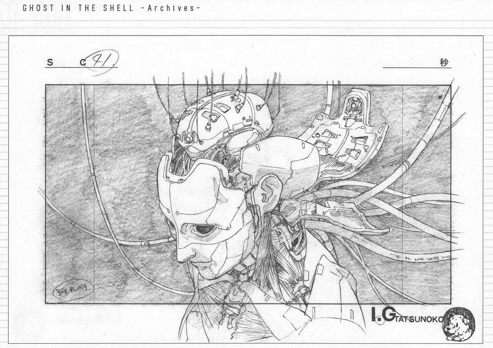

### Hi there 👋
<!-- * Daily Meditation via Leetcode/Competitive-Programming. -->
* Focus on OS/Database Kernel, Cloud/Distributed System, Literature.

-------

📊 **Weekly development breakdown**
<!--START_SECTION:waka-->

```txt
Python       10 hrs 50 mins  ████████████████████████░   96.66 %
C++          13 mins         ▒░░░░░░░░░░░░░░░░░░░░░░░░   01.95 %
Other        6 mins          ▒░░░░░░░░░░░░░░░░░░░░░░░░   01.00 %
PythonStub   0 secs          ░░░░░░░░░░░░░░░░░░░░░░░░░   00.12 %
Makefile     0 secs          ░░░░░░░░░░░░░░░░░░░░░░░░░   00.10 %
```

<!--END_SECTION:waka-->

-------

<!-- [](https://leetcode.com/fxrc) -->

<!---->
