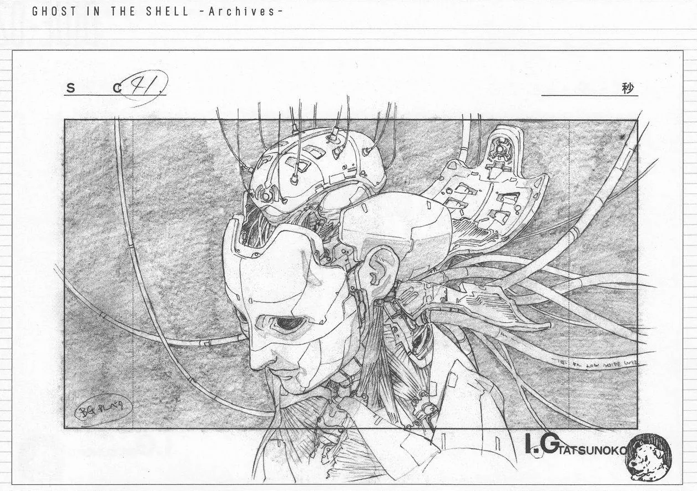

### Hi there 👋
<!-- * Daily Meditation via Leetcode/Competitive-Programming. -->
* Focus on OS/Database Kernel, Cloud/Distributed System, Literature.

-------

📊 **Weekly development breakdown**
<!--START_SECTION:waka-->

```txt
From: 30 September 2026 - To: 07 October 2026

Total Time: 23 mins

Go         19 mins               ████████████████████▓░░░░   83.29 %
Markdown   3 mins                ████▒░░░░░░░░░░░░░░░░░░░░   16.71 %
```

<!--END_SECTION:waka-->

-------

<!-- [](https://leetcode.com/fxrc) -->

<!---->
